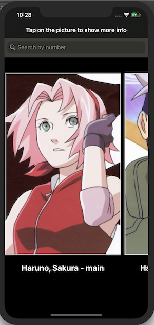
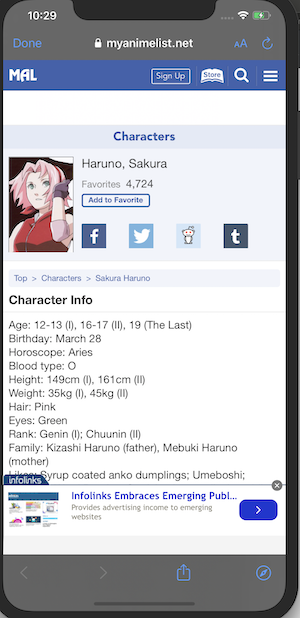

# MangaApp
## Description
This is a collection View app that allows the user to search manga / anime characters using the searach bar. The app uses a public manga api that populates the collection view cell with the characters names and their role in the manga series. 



Additionally there is a safari view when the user clicks on the characters image which transitions into a safari web page with additional character information.



```swift 
  
  add code here 

```

## Gif 

